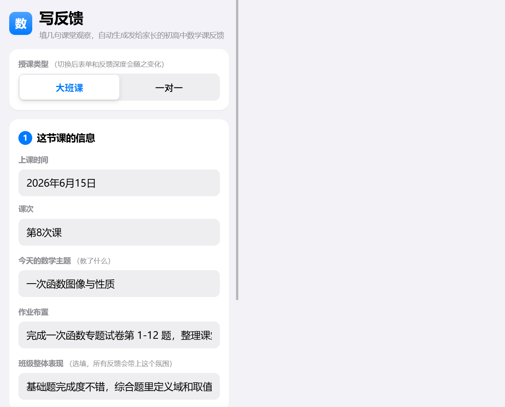
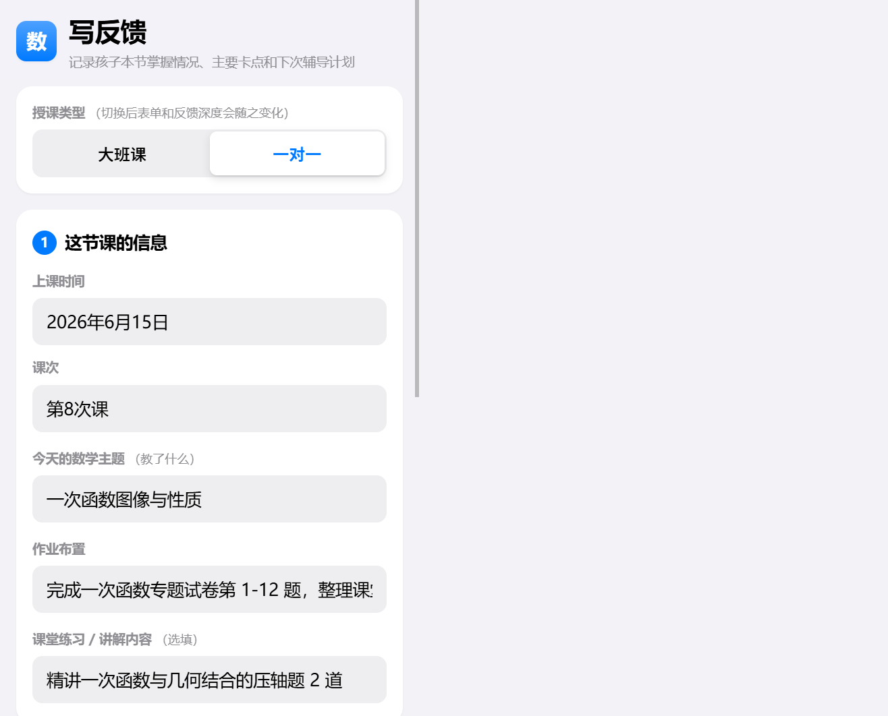
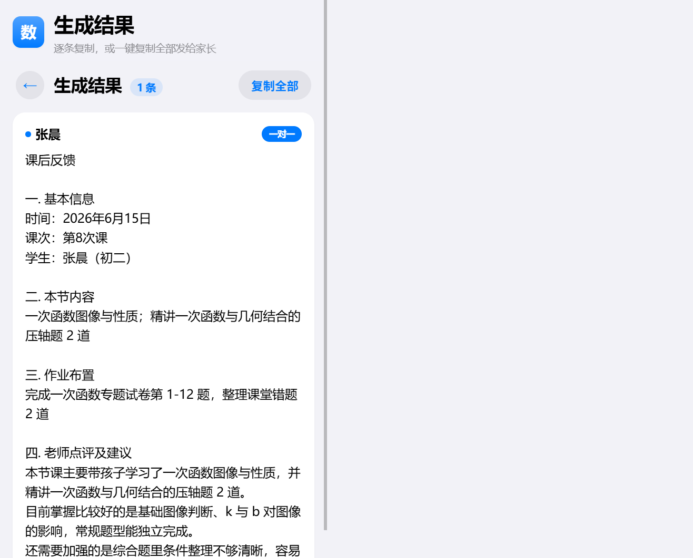

# 大班制与一对一辅导产品规格

## 背景

当前产品主要服务机构老师的课后反馈场景：老师填写一节课的基本信息、班级整体表现和多个学生的表现关键词，系统批量生成可发给家长的反馈。

新需求要求区分“大班制”和“一对一辅导”。这不是简单新增一个字段，而是要把同一个工具拆成两种清晰的授课场景：

- 大班制/小班课：一次课程，多名学生，快速批量生成。
- 一对一辅导：一次课程，一个学生，生成更完整、更有服务感的个性化反馈。

第一版优先服务机构老师，因此默认进入“大班课”。

## 产品目标

1. 保留现有大班课批量生成路径，不增加老师操作负担。
2. 为一对一辅导提供更细的输入结构，让反馈显得更个性化、更像服务汇报。
3. 两种模式共用同一套视觉风格、AI 开关、反馈语气和结果复制体验。
4. 第一版只验证“模式切换 + 两套输入结构 + 两套生成策略”，不提前做复杂后台。

## 信息架构

### 写反馈页

在写反馈页顶部增加“授课类型”切换：

- 大班课
- 一对一

切换后，表单主体变化，顶部标题、提示文案和主按钮文案同步变化。

### 我的格式页

第一版保持现有结构，不为两种授课类型单独拆模板。原因是当前重点是验证老师是否需要两种生成场景。

后续如果一对一使用频率高，再支持“按授课类型保存不同格式”。

### 生成结果页

大班课显示多张学生反馈卡；一对一显示单张更完整的反馈卡。

## 大班课模式

### 使用场景

机构老师上完一节大班/小班课后，需要快速给多位学生家长发送课后反馈。老师通常希望少填信息、快出结果，每条反馈不要太长。

### 字段

| 模块 | 字段 | 必填 | 说明 |
| --- | --- | --- | --- |
| 课程信息 | 上课时间 | 否 | 例如：2026年6月15日 |
| 课程信息 | 课次 | 否 | 例如：第8次课 |
| 课程信息 | 今天的数学主题 | 是 | 本节课讲了什么 |
| 课程信息 | 作业布置 | 否 | 统一作业 |
| 课程信息 | 班级整体表现 | 否 | 所有学生反馈都会参考 |
| 学员列表 | 学生姓名 | 是 | 每行一个学生 |
| 学员列表 | 课堂表现关键词 | 否 | 亮点在前，待加强在后 |
| 生成设置 | 反馈语气 | 是 | 温暖鼓励 / 专业简洁 / 活泼亲切 |
| 生成设置 | AI 智能生成 | 否 | 开启后走大模型，失败回退本地模板 |

### 默认文案

- 页面标题：写反馈
- 页面说明：填几句课堂观察，自动生成发给家长的初高中数学课反馈
- 主按钮：一键生成全班反馈
- 人数统计：0 名 / N 名
- 空名单提示：请先至少添加一名学员

### 输出策略

每名学生生成一条独立反馈，长度建议 60-120 字。内容结构：

1. 本节课内容或班级整体情况。
2. 学生一个具体亮点。
3. 一个待加强点。
4. 一句可执行的课后建议。

### 结果展示

结果页按学生分卡片展示：

- 学生姓名
- 反馈正文
- 单条复制按钮
- 一键复制全部

## 一对一辅导模式

### 使用场景

机构老师或辅导老师上完一对一课程后，需要给家长发送更完整的课后汇报。家长更关心孩子掌握情况、薄弱点、课后怎么练、下次课怎么安排。

### 字段

| 模块 | 字段 | 必填 | 说明 |
| --- | --- | --- | --- |
| 学生信息 | 学生姓名 | 是 | 单个学生 |
| 学生信息 | 年级/阶段 | 否 | 例如：初二 / 高一 / 高三一轮 |
| 课程信息 | 上课时间 | 否 | 例如：2026年6月15日 |
| 课程信息 | 课次 | 否 | 例如：第8次课 |
| 本节内容 | 今天的数学主题 | 是 | 本节课核心知识点 |
| 本节内容 | 课堂练习/讲解内容 | 否 | 例如：讲解模拟卷压轴题 3 道 |
| 掌握情况 | 已掌握内容 | 否 | 孩子目前比较稳的部分 |
| 掌握情况 | 主要卡点 | 否 | 本节暴露的关键问题 |
| 个性化建议 | 课后练习建议 | 否 | 具体练什么、怎么练 |
| 个性化建议 | 家长配合建议 | 否 | 家长在家可做的轻量配合 |
| 个性化建议 | 下次课计划 | 否 | 下节课准备处理什么 |
| 生成设置 | 反馈语气 | 是 | 与大班课共用 |
| 生成设置 | AI 智能生成 | 否 | 与大班课共用 |

### 默认文案

- 页面标题：一对一反馈
- 页面说明：记录孩子本节掌握情况、主要卡点和下次辅导计划
- 主按钮：生成一对一反馈
- 空学生提示：请先填写学生姓名

### 输出策略

一对一反馈比大班课更完整，长度建议 120-220 字。内容结构：

1. 本节课做了什么。
2. 孩子掌握较好的部分。
3. 目前最需要解决的问题。
4. 课后练习建议。
5. 下次课计划。

示例结构：

```text
本节课主要带孩子梳理了一次函数图像与性质，并结合几道典型题练习了待定系数法。孩子对基础图像判断掌握比较稳，能独立完成常规题型；目前主要问题是遇到综合题时条件整理不够清晰，容易跳步。

课后建议把今天错的两道题重新整理一遍，重点写清楚已知条件和解题步骤。下次课会继续做一次函数和几何结合的题型，帮助孩子提升综合分析能力。
```

## UI 组件体系

Figma 文件：

https://www.figma.com/design/jHBEW0h2nvs6ef65nyNoNx

### LessonModeSegmentedControl

用途：切换“大班课 / 一对一”，位于写反馈页第一张卡片上方或课程信息卡顶部。

设计要求：

- 两段式 iOS segmented control。
- 默认选中“大班课”。
- 视觉优先级高于“反馈语气”切换。
- 切换时页面说明和主按钮文案同步变化。

### CourseInfoCard

用途：承载两种模式共用的课程基础信息。

大班课显示：

- 上课时间
- 课次
- 今天的数学主题
- 作业布置
- 班级整体表现

一对一显示：

- 上课时间
- 课次
- 今天的数学主题
- 课堂练习/讲解内容

### ClassStudentListCard

用途：大班课专用，突出批量生成。

包含：

- 标题：这节课的学员
- 人数统计
- 学生行：姓名 + 课堂表现关键词 + 删除
- 添加学员按钮

### OneOnOneProfileCard

用途：一对一专用，突出个性化汇报。

包含：

- 学生姓名
- 年级/阶段
- 已掌握内容
- 主要卡点
- 课后练习建议
- 家长配合建议
- 下次课计划

### FeedbackToneControl

用途：复用现有语气切换。

选项：

- 温暖鼓励
- 专业简洁
- 活泼亲切

### GenerateCTA

大班课：

- 默认：一键生成全班反馈
- 加载中：正在生成…

一对一：

- 默认：生成一对一反馈
- 加载中：正在生成…

### ResultCard

大班课结果卡：

- 学生姓名
- 反馈正文
- 复制按钮

一对一结果卡：

- 学生姓名 + 一对一反馈标签
- 较长反馈正文
- 复制按钮
- 可选：下次课计划高亮信息

## 实现状态（已落地到代码）

由于当前 Figma 账号为 Starter + View 席位，Figma MCP 每月仅 6 次调用且已用尽，组件稿无法继续写入。作为临时替代方案，本方案已直接实现到项目真实代码中，并用本地浏览器产出状态对比图：

- 写反馈页顶部新增「授课类型」切换（大班课 / 一对一），见 [index.html](../index.html)。
- 切换时表单、页面说明、主按钮文案同步变化，状态持久化到 localStorage（key 升级为 `pfh_math_sec_state_v3`），见 [app.js](../app.js)。
- 一对一新增「这个孩子的情况」卡片：姓名、年级、已掌握、主要卡点、课后练习建议、家长配合建议、下次课计划。
- 一对一生成走更完整的服务汇报结构（基本信息 / 本节内容 / 作业 / 老师点评及建议 / 下次课计划），大模型只写点评正文，失败自动回退本地模板，见 [generator.js](../generator.js)。
- 大班课原有批量生成路径保持不变。

### 状态对比截图

大班课模式：



一对一模式：



一对一生成结果：



## 状态对比设计稿要求

Figma 状态对比页建议左右两栏：

- 左侧：大班课写反馈页
- 右侧：一对一写反馈页

两栏都使用 390px 手机画板宽度，保持现有 iOS 风格：

- 背景：#F2F2F7
- 卡片：白色，24px 圆角
- 主色：#007AFF
- 正文：16px
- 标题：20px / 34px
- 输入框：浅灰填充，14px 圆角
- 主按钮：蓝底白字，18px 圆角

## 生成提示词差异

### 大班课提示词重点

- 保持简洁。
- 不要写太长。
- 不要编造学生不存在的信息。
- 必须结合班级整体表现和学生关键词。
- 输出只包含老师点评正文，模板栏目由系统拼接。

### 一对一提示词重点

- 更像课后服务汇报。
- 必须包含掌握情况、主要卡点、课后建议、下次计划。
- 可以比大班课更完整，但不要空泛。
- 避免夸大承诺，不制造焦虑。
- 仍然保持老师原有朴实口吻。

## 暂不做

第一版不做：

- 学生历史档案。
- 长期成长曲线。
- Excel/名单批量导入。
- 大班课与一对一分别保存多套模板。
- 机构后台。
- 老师账号体系。
- 多班级管理。

## 验收标准

产品层面：

- 老师能明确知道当前是在“大班课”还是“一对一”模式。
- 大班课仍能快速批量生成。
- 一对一能生成明显更完整、更个性化的反馈。
- 两种模式不互相干扰。

UI 层面：

- 新增组件延续现有 iOS 风格。
- 授课类型切换足够醒目。
- 一对一字段虽然更多，但不显得杂乱。
- 大班课页面不因为新增模式而变复杂。

技术层面：

- 本地状态需要保存当前授课类型。
- 旧用户打开页面时默认进入大班课。
- AI 失败时两种模式都应能回退本地模板。
- 结果复制逻辑保持一致。
